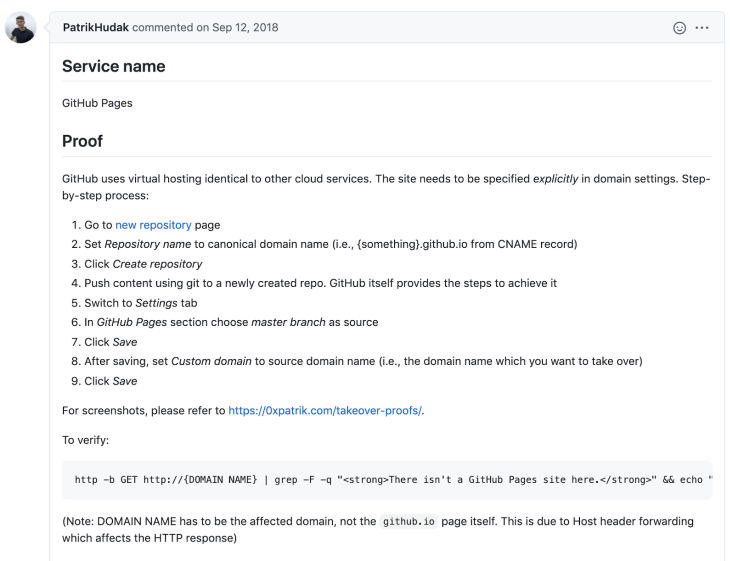
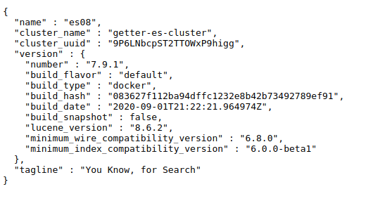
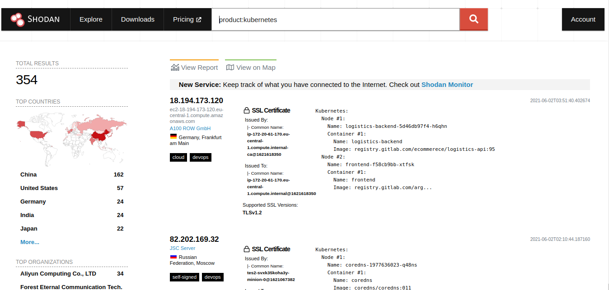

# Exploitation Phase - [Part-1]
- When searching for vulnerabilities I always start out looking for low hanging fruit.
## 1. Subdomain Takeover 
### 1.1 Intro
- Searching for subdomain takeovers is one of the easiest vulnerabilities you can find and it normally pays fairly well.
-  A subdomain takeover occurs when a domain is pointing to another domain (CNAME) that no longer exists.
-  If an attacker were to register that non existing domain then the targets subdomain would now point to your domain effectively giving you full control over the target’s subdomain.

### 1.2 Subdomain Takeover
- You should be searching for subdomain takeovers on a daily basis. Just because you checked your target yesterday doesn't mean they are safe today.
- Before you can check for subdomain takeover you need to get a list of your target’s subdomains, this should have been done during the recon phase
- Once you have a list of subdomains checking for this vulnerability should only take about 5 minutes with the following tool:
	-  https://github.com/haccer/subjack
```bash
./subjack -w <Subdomain List> -o results.txt -ssl -c fingerprints.json
```

- The next step is to see where this domain is pointing to so we can try to take it over
	 ```bash
	dig <Domain Here>
	```

---
### 1.2.1 [Updated] Subdomain Takeover 
- What makes this vulnerability so interesting is that you can be safe one minute and a single DNS change can make you vulnerable the next minute.

- The vulnerability here is that the target subdomain points to a domain that does not exist. An attacker can then register the non existing domain. Now the target subdomain will point to a domain the attacker controls.

- You can take reference of the following Github Page if going for subdomain Takeover:
	- https://github.com/EdOverflow/can-i-take-over-xyz
### Github Takeover
- One of the easiest ways to spot a subdomain takeover vulnerability is by the error message it throws as shown below:
 
 - you can follow the tutorial in the subdomain takeover github page as shown below:
 
 --- 
### 1.3 Conclusion
- Subdomain takeover is one of the easiest high impact vulnerabilities you can search for. As long as you have a list of subdomains checking for this vulnerability is a matter of running a command. Administrators are constantly changing DNS setting so a company may be safe one day and vulnerable the next because of this it’s a good idea to constantly check for this vulnerability.
- ---

## 2. Github
- When performing your initial recon on an organization don’t forget about GitHub. GitHub is used by developers to maintain and share their code, most of the time they end up sharing much more though.

### 2.1 Github Dorks
- GitHub dorks are basically the same thing as google dorks. A dork is used to find specific information in a sea of information. It helps us narrow down the search to exactly what we want.
- This can be very handy when searching for sensitive files, API keys, passwords, and a lot more.
- We can use dorks to find sensitive files that developers might have accidentally uploaded.
	- filename:.bash_history DOMAIN-NAME
- A good list of these dorks can be found below:
	- https://github.com/techgaun/github-dorks/blob/master/github-dorks.txt

### 2.2 Company Github
- Instead of using GitHub dorks to find exposures you might want to go directly to the source. To do this you must find the companies GitHub page and from there you can locate all their developers and monitor their accounts.
- Once you find a company's page you want to get a list of people that are associated with the company. This can be done by clicking on the “people” tab.
- Now you will need to manually go through each one and look for exposures. 
- You should be looking for URLs, api keys, usernames, paswords, vulnerabilities, and anything else that could provide value.

<hr>

## 3. Misconfigured Cloud Storage Buckets
- Today companies are moving their infrastructure to the cloud as it is more convenient to ent resources from third parties. However, cloud services can be tricky to set up roperly if you don’t know what you’re doing thus people mess things up and introduce vulnerabilities into their environment. 
- One of the most popular vulnerabilities is finding an exposed cloud storage bucket. These buckets are used to store files so depending on what's in the bucket you might have access to sensitive information.

### 3.1 AWS S3 Bucket
- Amazon Web Services (AWS) is by far the most popular cloud service provider out there. The vast majority of cloud instances you come across will be hosted on this provider.

#### 3.1.1 Bucket Dorks
- google dork can be used to find buckets belonging to a company:
	- site:.s3.amazonaws.com "Starbucks"

#### 3.1.2 S3 Bucket Brute force
- There are way too many S3 bucket brute force tools:
	- https://github.com/ghostlulzhacks/s3brute
	```Bash
	python amazon-s3-enum.py -w BucketNames.txt -d <Domain Here>
	```
- If you go to the vulnerable endpoint you should be able to list all files in the bucket. You should be looking for sensitive files such as backup files, zip files, user data, and any other PII information

### 3.2 Google Cloud Storage
- The following tool can be used to brute force these bucket names. Similar to by AWS tool it uses permutations to generate bucket names.
	- https://github.com/RhinoSecurityLabs/GCPBucketBrute
- Once you find a vulnerable endpoint visit it and search for sensitive files siilar to the AWS process.

### 3.3 Digital Ocean Spaces
- If you are familiar with S3 buckets Digital ocean spaces are literally the same exact technology
	```Bash
	site:digitaloceanspaces.com <Domain Here>
	```
	- This will give you sensitive files. 

	
## 4. Elastic Search DB
- ES is a document-oriented database designed to store, retrieve, and manage document-oriented or semi-structured data. When you use Elasticsearch, you store data in JSON document form. Then, you query them for retrieval.
- You have probably heard of the popular relational database called MySQL. Elastic search like MySQL is a database used to hold and query information.
- However, elastic search is typically used to perform full text searches on very large datasets.
- Documents are basically a json blob that hold your data as shown in the example below:
{"id":1, "name":"ghostlulz", "password":"SuperSecureP@ssword"}

### 4.1 Unauthenticated Elasticsearch DB
- Elastic search has an http server running on port 9200 that can be used to query the database. The major issue here is that a lot of people expose this port to the public internet without any kind of authentication.
- This means anyone can query the database and extract information. A quick Shodan search will produce a tun of results as shown below:
	
- Once you have identified that your target has port 9200 open you can easily check if it is an Elasticsearch database by hitting the root directory with a GET request. The response should look something like:

	
	
<hr>

## 5. Docker API
- When you install docker on a system it will expose an API on your local host located on port 2375. This API can be used to interact with the docker engine which basically gives you the right to do anything you desire unauthenticated.
- Under these conditions no external party will be able to access your docker API as it isn't exposed to the world. However, in certain instances this API can be changed so that it can be accessed by external resources.
- Once you have confirmed that a docker API is exposed I will generally move to the CLI version of docker. From the CLI you can execute the following command to get a list of containers that are currently being ran:
	```Bash
	docker -H <host>:<port> ps
	```
	
- We can easily pop a shell in a container by running the following command:
```bash 
Docker -H <host>:<port> exec -it <container name> /bin/bash
```
- You aren't just limited to popping a shell on their docker container, you can do other things such as deploying your own docker containers.

<hr>

## 6 Kubernetes API
- Kubernetes exposes an unauthenticated REST API on port 10250. If developers aren’t careful this API can be exposed to the internet.
-  A quick Shodan search will find a bunch of these services.
	-  
-   Once a Kubernetes service is detected the first thing to do is to get a list of pods by sending a GET request to the /pods endpoint.

<hr>

## 7. .git / .svn
- Source code repositories like GitHub are extremely popular. A lot of people will simple copy down a git directory and throw it on their website without realizing they might have just exposed their sites source code to the world. 
- Git and ubversion are two of the most popular revision control systems and they contain  hidden file that can cause a lot of harm if uploaded to your website.

### 7.1 Git
- Git is a revision control system and it contains a hidden folder “.git” . This folder basically acts as a snapshot for your project. Every-time you create a file git will compresses it and stores it into its own data structure.
- You can then recreate the repository which will contain the websites source code. To recreate the repository, you can use the following tool:
	-  https://github.com/internetwache/GitTools/tree/master/Dumper
	-  To use the tool type 
	```Bash
	./gitdumper.sh https://example.com/.git/ /output-directory/
	```
- Next you manually review the source code and look for bugs, vulnerabilities, and exposed passwords. You should treat it as a source code review.

### 7.2 Subversion
- Subversion like Git is a revision control system and it contains a hidden folder “.svn” . This folder can also be used to recreate the source code used on the site.
- The following tool can be used to extract the files from the folder:
	-  https://github.com/anantshri/svn-extractor
- Like Git once everything is download you will manually review the source code and look for bugs, vulnerabilities, and exposed passwords. Basically, treat it as a source code review.
---
### 8. Google Firebase [Updated]
- The Firebase Realtime Database is a cloud-hosted database stored as JSON and synchronized in realtime to every connected client.
- <b>Misconfigured Firebase Database</b>
	- You can check if user is using Google Firebase by observing the url:
		- *.firebaseio.com
	- If the developer forgot to enable authentication the database will be exposed to the word. You can easily view the database by appending a “/.json” to the url as shown below:
		-  vuln-domain.firebaseio.com/.json

### 9. Mongo Database [Updated]
- MongoDB is a nosql database that uses JSON-like documents to store data.
- If you're searching for MongoDB instances, be on the lookout for port 27017.
-  MongoDB doesn't have authentication enabled by default so to test for this vulnerability just try to login.
	```bash
	mongo -ip-address-here
	```
- 
- 