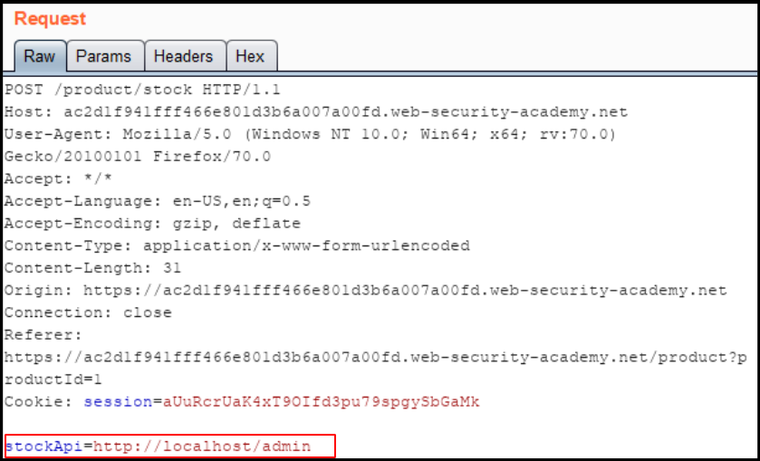
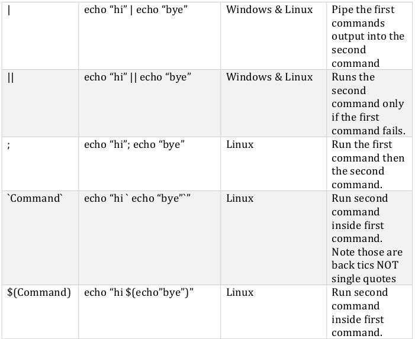
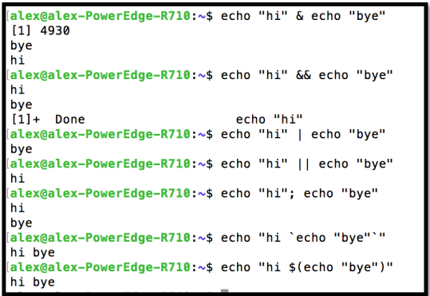
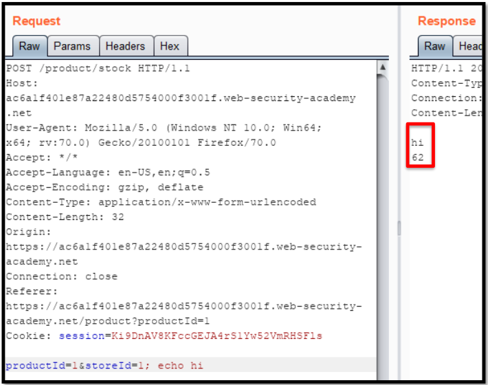

# Exploitation Phase [Part-2]
## 1.Exploiting CMS
- A content management system (CMS) is a software application that can be used to manage the creation and modification of digital content

### 1.1 Wordpress
- There are in fact hundreds of exploits and misconfigurations impacting WordPress and its associated plugins. One common tool to scan for these vulnerabilities is wpscan: 
	-  https://github.com/wpscanteam/wpscan
-  TIP: Always make sure to check “/wp-content/uploads/” .

### 1.2 Joomla
- If you want to scan for vulnerabilities the most popular tool is Joomscan: 
	-  https://github.com/rezasp/joomscan
	```bash
	perl joomscan.pl -u <URL Here>
	```

### 1.3 Drupal
- If you find a Drupal site you want to use droopescan to scan it
	- https://github.com/droope/droopescan	
```bash
python3 droopescan scan Drupal -u <URL Here> -t 32
```

### 1.4 Adobe AEM
- If you want to scan an application for vulnerabilities use
the tool aemhacker:
	-  https://github.com/0ang3el/aem-hacker
```bash
python aem_hacker.py -u <URL Here> --host <Your Public IP>
```
- Note that in order to test for the SSRF vulnerabilities you need to have a public IP that the target server can connect back to.

- If you come across a CMS you haven't seen before the first step is to go to xploit db and see if it has any known CVEs:
	-  https://www.exploit-db.com/

<hr>

## 2. Eploitation OWASP
- The only tool you need is Burp Suite: 
	-  https://portswigger.net/burp

### 2.1 XML External Entity (XXE)
- XML External Entity (XXE) is a vulnerability that can appear when an application parses XML
- you can use external entities to grab data from a file on disk and store it in a variable. What if we tried to read data from the “/etc/passwd” file and store it in a variable? Note that in order to read the data the entity must be returned in the response.
- Exploitation:
	- Capture the POST request in Burp. Whenever you see XML you should test for XXE :
	- To test for XXE simply put in your malicious external entity and replace each node value with it as shown below:
	
	- If the server doesn’t block external entities the response will be reflected. 
	
	
### 2.2 Cross Site Scripting (XSS)
- This vulnerability can be used to execute malicious JavaScript in a user’s web browser. This could then be used to steal users JWT tokens, CSRF tokens, and cookies. 
- There are three types of XSS reflected, stored, and DOM based.
	1. <b><u>Reflected XSS:</u> </b>  Suppose you have an application which produces an error message when you type in the wrong user name and password. The error message could look something like this:
		<i>“The email or password you entered is not valid. Please try again.”</i> 
		- You then notice that there is a GET parameter in the URL which has this same message:
	  <i>“example.com/login.php?error=The+email+or+password+you+entered+is+not
valid.+Please+try+again.”</i>
 - If the application doesn’t protect against XSS we could insert malicious JavaScript code into the user browser.
	2. <b><u>Stored XSS:</u> </b>
	 
	- Suppose you have an application that allows you to create an account. The application also has a page which lists out all the members of the site. You could assume that the username you create is being stored in the backend database otherwise how would the application be able to retrieve this information. If youwere to put a malicious JavaScript payload as your username it would then be stored in the back-end database. If the application isn’t blocking XSS attacks whenever someone visits the members list page your username would be retrieved from the back-end database and your XSS payload would trigger.
	
	3. <b><u>DOM XSS:</u> </b>
	- Document Object Model (DOM) based XSS occurs when an application takes user supplied input passes it to a JavaScript function and that function uses the input to modify the DOM environment.
	- 

### 2.3 SSRF
- Server-Side Request Forgery (SSRF) occurs when an attacker forces an application to make HTTP requests on their behalf.
- This can be used to read data from internal applications. Most people leverage this vulnerability to post or read data from sensitive endpoints such as AWS and Gcloud metadata service, FTP service, LDAP service, and local files.
- How to Find?
	- search for requests that have a URL as a parameter value
	- If the response is reflected back to the attacker you could have a possible SSRF vulnerability.
	- then change the URL to google.com and if I see a response then you can assume the endpoint is vulnerable.


 - The stock API value is changed to admin's dirctory on Local IP. The request will be performed by the target application thus it will perform a request against itself. This endpoint has an admin application hosted on the local host, normally this would be impossible to access from the internet but because of SSRF we can.			

### 2.4 Cross Site Request Forgery (CSRF)
- CSRF is an attack performed on an applications user that causes their browser to send requests on behalf of the attacker. 
- This can be used to change a user’s password and email, like a page or video, send money to an attacker, and anything else you can do via a POST request.


- Impact: Suppose an application allows users to change their email by submitting a form. If the application fails to protect against CSRF attacks attackers could force users to change their email to an attacker controlled email. After that the attacker could perform a password reset to change the users password and take over their account.


### 2.5 SQL Injection
- This vulnerability can be exploited to dump the contents of an applications database.
- A nice cheat sheet can be found on payloadallthethings:
	- https://github.com/swisskyrepo/PayloadsAllTheThings/tree/master/SQL%20Injection
 
 
 - If you ever see that error you know there is SQL injection


- Basically, you ask the database “do you have 1 column?”, the server will then respond and says yes. You then ask “do you have 2 columns?” and the server responds again with yes. Then you ask “do you have 3 columns?” and the database errors out. So, you know the database table only contains 2 columns. 
    --> ‘ order by <Number here>--
	
- After getting to know about number of columns we need to figure out which columns are used to display text on the application.
 - We need to know this so we know which column to use when extracting data. 
	-->  select NULL,NULL—
- To do this we can replace each selected column with a string and see if it appears on the page.
    --> ' union select NULL,'VULNERABLE'--
- The first thing we need to retrieve are the table names in the current database. 
- We can list every table in the database.
   --> ' union select NULL, table_name from database_name.tables—
- The next step is to determine this tables column names.
   --> ' union select NULL, column_name from information_schema.columns where table_name = 'Table_Name' —
- The final step is to exfiltrate the data. To return the password and username in the same column we can use the “concat()” function.
	--> ' union select NULL, concat(Column_Name,':',Column Name 2>) from Table_Name --
- However, in the real world if you find a vulnerable endpoint it’s probably best to use a tool like SQLmap as its easier and faster.
	- https://github.com/sqlmapproject/sqlmap

### 2.6 Command Injection

- Attackers can leverage this vulnerable to gain remote code execution (RCE) on their target.
- Depending on the operating system you can use several techniques to execute additional commands thus allowing an attacker to gain RCE.



	
- Commnad Injection Example:


	
- Command Injection - Request & Response



- As you can see, on injecting the “echo hi” command and I received a response. This is a very strong indicator that the application is vulnerable to command injection. However, the vast majority of these bug are blind and you won’t see any output making it harder to detect.
	