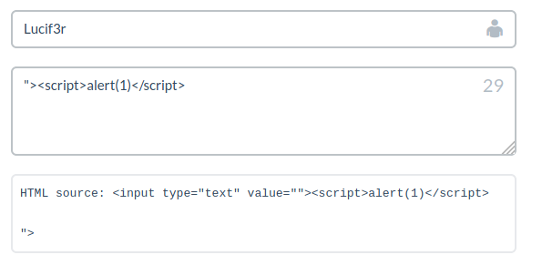
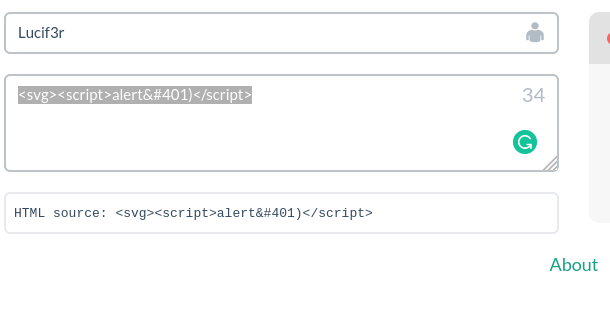
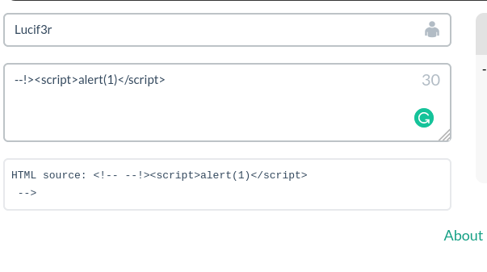
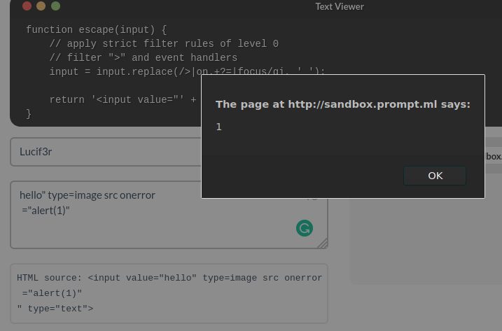
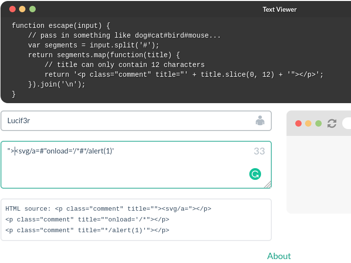

# Cross Site Scripting (XSS)
There are many methods for finding a XSS vulnerability. Some of the methods are given as follows. 
You can check for XSS by following methods:

### 1.  Source Code Method
1. Look for an Input section on the Web Page. It can be search box, comment box, signup or anything else.
2. Type any random query in the Input field, to check if it reflects on the web page. 
3. If it reflects, view the source code of the page and analyze how is your input being relflected. 
4. Your goal is to add your script in such a way it get executed. For Example:
``` javascript
"><script>alert(1)</script>
```
Here "> will close the existing tag and your script will be executed (If the website is vulnerable to xss).

- Following are some of the techniques to craft your payload: 


	- We can use <svg/onload=alert(1); and thus we will not require any closing tag. this will automatically execute once the webpage loads.	
	 
	 
	 - when one of the parentheses is filtered, we will have to convert the parenthesis into HTML using encodings. \[Tip: use HTML Encoding online\]
	 -  Whenever your input reflects as plain text, you should use SVG Vector. It loads on the plain text. for eg ( - &#40
	 
	 
	 - It is most obvious that you should check for the function and try to decode it. For example, a function may ask you that accepts the HTTP links only, then you should try to fit in your payload accordingly. 
	 -  When input reflects within ">: and the closing is FILTERED simply convert it  into HTML code so that the browser directly execute that (TIP: you can try changing the type="text")
	  
	  8.  ```<p>``` Tag represents plain text, where you will have to use ```<svg>``` tags example: ```<svg/onload=alert(1)``` if there is further filtering like they are talking only 12 characters. You can: ```<svg/a="onload" where a = variable```
  	
	
---
	
### 2. Through Hidden Variables 
1. Browse the web page and open its source code 
2. Look for the Hidden or Unused variables.
3. You can do it by searching terms like ```var = ``` or ``` =""``` or ``` =''```
4. Now add it to the URL of web page. Ex: https://www.target.com?variablename=xss


---
	