# Miscellaneous 
## 1. On Site Request Forgery (OSRF)
- Similar to cross site request forgery(CSRF) with OSRF an attacker can force a users web browser to make requests on the attackers behalf.
-  The only difference is that the request is initiated from the target application whereas CSRF is initiated from an attacker controlled site.


- The whole goal of this vulnerable application is to force the user to send a request to the “/admin/add” endpoint. Doing so will cause the application to add an admin user which the attacker could use to login to the victims application.
- Remember the goal is to make the user browser send a request to “127.0.0.1/admin/add?username=ghost&password=lulz”. This would create a new admin user called “ghost” with the password of “lulz”.
- Take a closer look at the “/” endpoint and how the “vuln_param” is used to create the src attribute of the image tag. What if an attacker were to input “../../”?
	 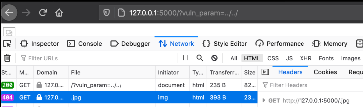
	- As you can see above it caused the application to send a GET request to the path“/” instead of “/images”.
	
- The above request is a little better, if you look at the bottom right of the image you can see the browser make a request to “/admin/add.jpg”. If we add the username and password parameters we should be able to add an admin account as shown below:
	 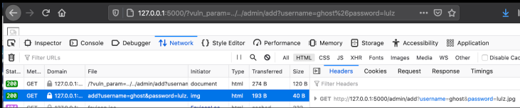
	- Note when sending multiple parameters we must URL encode the “&” character otherwise the browser will think it belongs to the first request not the second. Also notice how the password is “lulz.jpg” and not “lulz”. This is because “.jpg” is appended to the string at the end to get rid of these characters in our password we can just add a dummy parameter as shown below:
		- http://127.0.0.1:5000/?vuln_param=../../admin/add?username=ghost%26password=lulz%26dummy_param=

		 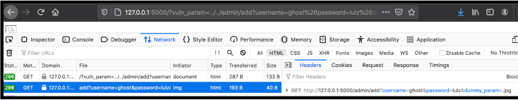
		 
	 - Finally we are able to make a request to the “/admin/add” endpoint causing the application to add a new user called “ghost” with the password of “lulz”.

<hr>

## 2. Prototype Pollution
### 2.1 What is Prototype ?
- Javascript is a prototype based language. Prototypes are the mechanism by which JavaScript objects inherit features from one another. This means that if the prototype object is modified in one object it will apply to every other object as shown in the below example:

	
	 -  As you can see above we have two variables called “a” and “b”. We modify the prototype object in variable “a” by adding a variable called “foo” and giving it the value of “bar”.
	 -  You might think that this would have no effect on variable “b” but it does. The modified prototype object is inherited by variable “b”, so when we call the “foo” variable on “b” it prints “bar”.
	

### 2.2 Prototype Pollution?
- As stated earlier javascript is a prototype based language, this means that if we modify the prototype object it will persist to all other objects. Take a look at the following code, the goal here is to set the “admin” variable to true:
	 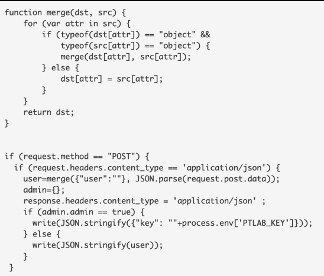
- Here, we are merging user supplied data with the user object. 
	- Next it will create a variable called admin and it will check if “admin.admin” is set to true. If it is, we win. 
	- Under normal circumstances this would be impossible as we never get the change to modify this variable but with prototype pollution we can.
- During the merge process if it comes across a prototype object it will add that to the user object. Since the prototype object is inherited by all other objects we can potentially modify other variables as shown in the below curl request.

- In the above image we are sending a prototype object with a variable called “admin” which is set to “true”. When the line checks to see if admin.admin is set to true it will pass because the admin object inherited the admin variable from the prototype object which we modified.

Although this is a lesser known vulnerability it is just as deadly as anything else. In the past this has led to XSS, DOS attacks, and RCE so there is no limit to what you can potentially do with this.

<hr> 

## 3. Client Side Template Injection
### 3.1 Angular Basics
- Few Things one should understand when dealing with Angular Applications, such as Templates, Expressions, and Scopes - for Client Side Template Injection
- A <b>template</b> is an HTML snippet that tells Angular how to render the component in Angular application.
- The main advantage of templates is that you can pass in data allowing you to dynamically generate HTML code based on the arguments passed to it. An example template can be found below:
	- ``` <h1>Welcome {{Username}}!</h1>```
	- The “{{Username}}” is an expression and changes based on your username.
- Expressions are Javascript like code snippets . Like Javascript expressions Angular expressions can contain literals, operators, and variables as shown below:
	- 1+1			
	- A+b
	- User.name
	- Items[index]
- Angular expressions are evaluated against the Scope object. Basically what this means is if you try to evaluate “alert(1)” it will fail because the scope does not have an “alert” function (unless you define one).

### 3.2 Client Side Template Injection (XSS)
- Client-side template injection vulnerabilities arise when applications using a client-side template framework dynamically embed user input in web pages
- As you know Angular is a client side template framework and you can embed user input into these templates. This makes Angular the perfect target for this type of vulnerability.
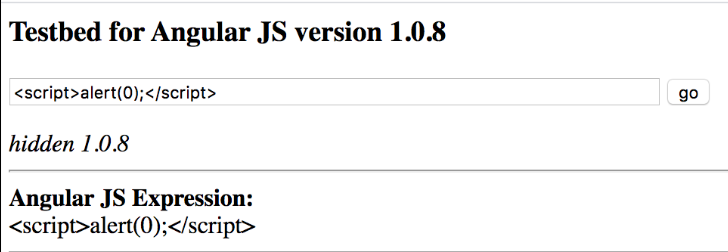
-  As you can see we didn’t get an alert box and that's because the server is encoding our input before passing it to the template as shown below.

	

- In Angular we can use expressions which does not have to use special characters which get encoded by the “htmlspecialchars” PHP function as shown below:
  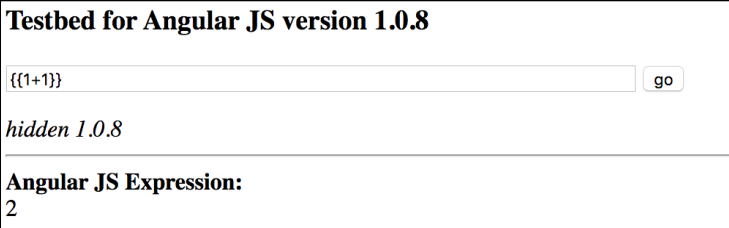
  
	- As you can see above I am using the expression “{{1+1}}” which gets evaluated to “2”. This is a very strong indicator that the application is vulnerable to client side template injection.
-  Forcing an application to add two numbers together isn’t all that exciting, but what if we could inject javascript code. We know we can't simply insert an “alert(1)” function because that function is not defined in the scope object.
-   Behind the scenes “alert(1)” turns into “$scope.alert(1)”. By default the scope object contains another object called “constructor” which contains a function also called “constructor“. This function can be used to dynamically generate and execute code. This is exactly what we need to execute our XSS payload as shown below:
	
- As you can see above our malicious Angular expression was injected into the page causing the application to dynamically generate and execute our payload.
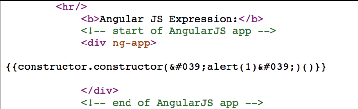

<hr>

## 4. XML External Entity (XXE)

### 4.1 XML Basics
- Extensible Markup Language(XML) is a language designed to store and transport data similar to JSON.
- Example:
```xml
<?xml version="1.0" encoding="UTF-8"?>
<bookstore>
	<book category="cooking">
		<title lang="en">Everyday Italian</title>
		<author>Giada De Laurentiis</author>
		<year>2005</year>
		<price>30.00</price>
	</book>
	<book category="children">
		<title lang="en">Harry Potter</title>
		<author>J K. Rowling</author>
		<year>2005</year>
		<price>29.99</price>
	</book>
</bookstore>
```

- Pro tip if you ever see this in burp you should immediately test for XXE:
```xml
<?xml version="1.0" encoding="UTF-8"?>
```
-	 There is an Entity, which act as varibale.

### 4.2 XML External Entity Attack
- You can use external entities to grab data from a file on disk and store it in a variable. What if we tried to read data from the “/etc/passwd” file and store it in a variable ?
- <b>Note</b> that in order to read the data the entity must be returned in the response.
	 
 - To test for XXE simply put in your malicious external entity and replace each node value with it as shown below:
 	
	-	As You can see, an external entitiy is created to grab the data in the /etc/passed file and stored in the entity xxe. If theserver does not block external entities the response will be reflected to you.
	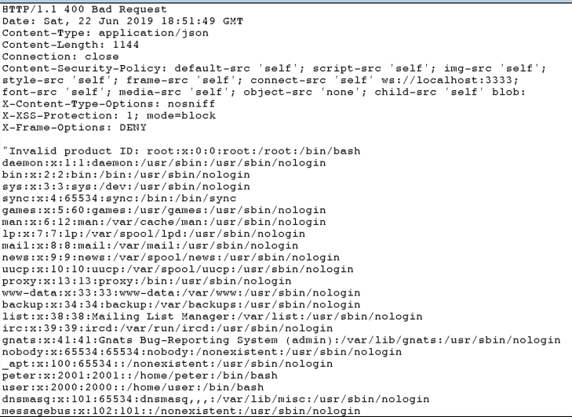
## 5. Content Security Policy Bypass
The CSP is a special HTTP header used to mitigate certain types of attacks such as cross site scripting (XSS).
### 5.1 Basics
- The CSP header is fairly straightforward and there are only a few things you need to understand. First, the CSP header value is made up of directives separated with a semicolon “;” .
- A list of these directives can be found below:
	-  Default-src: This acts as a catchall for everything else.
	- Script-src: Describes where we can load javascript files from
	- Style-src: Describes where we can load stylesheets from 
	- Font-src: Describes where we can load fonts from
- These directives are set to specific values which defines which resources can be loaded and from where
	- * :  Load resources from anywhere
	-  ‘none’: Block everything
	-   ‘Self’: Can only load resources from same origin
	-   Data: Can only load resources from data schema (Base64)
	- Something.example.com: Can only load resources from specified domain
	- Https: Can only load resources over HTTPS
	- ‘Unsafe-inline’: Allows inline elements (onclick,```<script></script>``` tags, javascript:,)
	- ‘Unsafe-eval’:Allows dynamic code evaluation (eval() function)
	- ‘Sha256-‘: Can only load resources if it matches the hash
	- ‘Nonce-‘: Allows an inline script or CSS to execute if the script tag contains a nonce attribute matching the nonce specified in the CSP header.
### 5.2 Basic CSP Bypass
- One of the easiest ways to misconfigure the CSP is to use dangerous values when setting policies. For example suppose you have the following CSP header:
	-  <b>default-src 'self' *</b> : the default-src policy acts as a catch all policy, (* acts as a Wild Card). So this policy is basically saying allow any resources to be loaded. It's the same thing as not having a CSP header! You should always look out for wildcard permissions.
	-  <b>script-src 'unsafe-inline' 'unsafe-eval' 'self' data :https://www.google.com http://www.google-analytics.com/gtm/js https://*.gstatic.com/feedback/https://accounts.google.com :</b>   Here we have the policy script-src which we know is used to define where we can load javascript files from. Normally things like ``` ``` would be blocked but due to the value ‘unsafe-inline’ this will execute.

There are few other techniques which can be used to bypass the CSP

### 5.3 JSONP CSP Bypass
- JSONP is a way to bypass the same object policy
(SOP). 
- A JSONP endpoint lets you insert a javascript payload , normally in a GET parameter called “callback” and the endpoint will then return your payload back to you with the content type of JSON allowing it to bypass the SOP. 
- Basically we can use the JSONP endpoint to serve up our javascript payload. 
- You can find an example below
	- https://accounts.google.com/o/oauth2/revoke?callback=alert(1337)
	
- The danger comes in when a CSP header has one of these endpoints whitelisted in the <b>script-src policy</b>. This would mean we could load our malicious javascript via the JSONP endpoint bypassing the CSP policy. Look at the following CSP header:
	- script-src https://www.google.com http://www.google-analytics.com/gtm/js https://*.gstatic.com/feedback/ https://accounts.google.com ;
	- The following would get blocked by the CSP:
		- http://something.example.com/?vuln_param=javascript:alert(1) ;
	- What if we tried the following:
		- http://something.example.com/?vuln_param=https://accounts.google.com/o/oauth2/revoke?callback=alert(1337)
	- This would pass because accounts.google.com is allowed to load javascript files ccording to the CSP header. We then abuse the JSONP feature to load our malicious javascript.

### 5.4 CSP Injection Bypass
- The third type of CSP bypass is called CSP injection. This occurs when user supplied input is reflected in the CSP header. 
- Suppose you have the following url:
	- http://example.com/?vuln=something_vuln_csp
- If your input is reflected in the CSP header you should have something like this: 
```
script-src something_vuln_csp;
object-src 'none';
base-uri 'none';
require-trusted-types-for 'script';
report-uri https://csp.example.com ;
```
- This means we can control what value the script-src value is set to. We can easily bypass the CSP by setting this value to a domain we control.

<hr>

## 6. Relative Path Overwrite (RPO)
It is an older lesser known vulnerability, which can be used for XSS or extracting sensitive data but the vast majority of the cases can only be exploited for web
defacement.
- It is an interesting Vulnerability bcoz, only few people know how to exploit this bug.

### 6.1 RPO
- First you need to find a page that reflects the current url, path, or referrer header in the response. 
- Secondly you need the page to be missing the “DOCTYPE” tag to enable quirks mode.
-  Third, you need the endpoint to have a wild card path so “example.com/vuln.php” is the same as “example.com/vuln.php/somthing/”. 
-  Finally you need to find if there are any style sheets being imported using a relative path. 
-  If all these requirements are met you can probably exploit the RPO vulnerability.


To understand RPO you first thing you need to learn about is how browsers use pathrelative links to load content.
 ```
 <link href="http://example.com/style.css" rel="stylesheet" type="text/css"/>
 ```
```
<link href="/style.css" rel="stylesheet" type="text/css"/>
```
```
<link href="style.css" rel="stylesheet" type="text/css"/>
```   

- As you can see above there are a few ways an application can load the CSS file “style.css”.
-  The first example uses an absolute link which is the full path to the CSS file.
-  The second example starts at the root of the web directory and looks for the “style.css” file there. 
-  Finally the last example uses a relative path so it will look at the current directory for the “style.css” file, if the url is “example.com/test/” it will look for the CSS file at “/test/style.css”.

<b>Quirks Mode :</b> Quirks mode was designed to
gracefully handle the poorly coded websites which was fairly common back in the day. If quirks mode is enabled the browser will ignore the “content-type” of a file when processing it. So if we pass an HTML file to a link tag it will still parse the HTML file as if it's a CSS file. If Quirks mode is disabled the browser would block this action.

- Examine the Vulnerable Code: 

	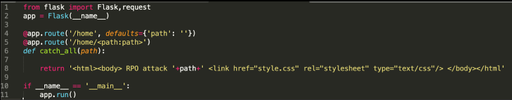
	
	- Look at the above image we can clearly see the “path” variable is concatenated with the output but normally you don't have access to the source so you will need to manually verify this as shown below. 
	 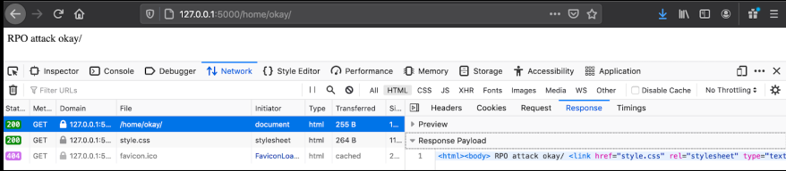
	 - Above you can clearly see the “okay/” path displayed on the page. We can also see the “document type” tag is missing from the HTML source so we know the page is running in quirks mode. Next we need to figure out if “/home/okay/” resolves to the same page as “/home” which it does.
	 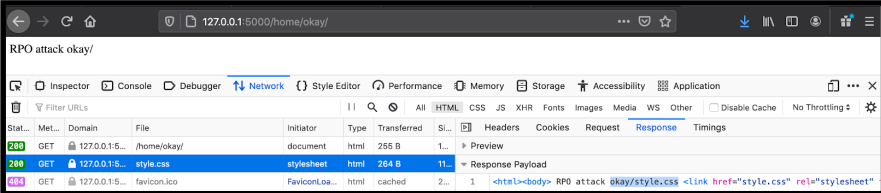
	 - As shown above when we change the URL to “/home/okay/” the “Link” tag tries to import its stylesheet from “/home/okay.style.css” this is because the Link tag is using a relative path. Also notice how the style sheet resolves to the same HTML source as “/home”. This is because there is a wild card path after “/home” which causes any path after “/home” to resolve to “/home”.
 - The last step is to actually launch the exploit to see if it works. Since the Link tag is accepting the HTML output as CSS and user controlled input is reflected in that output an attacker could inject CSS commands causing the page to execute them.
	 - %0A{}*{color:red;}///
	  
	 - As you can see above we injected CSS code to turn the font red so we now know the target is vulnerable.

<hr>
