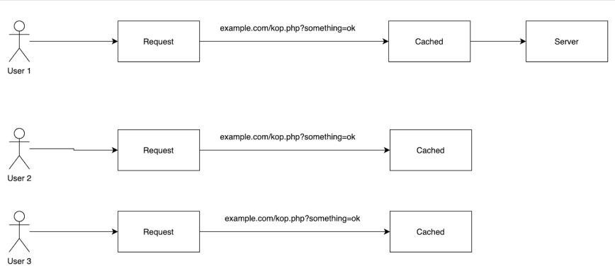
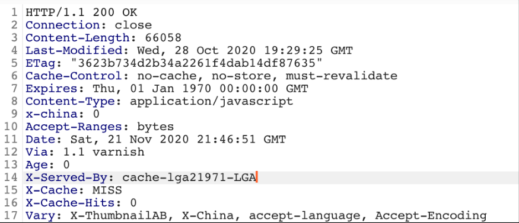
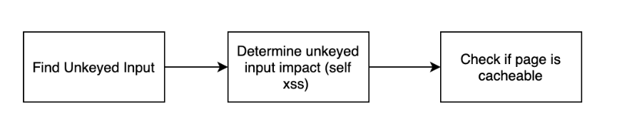
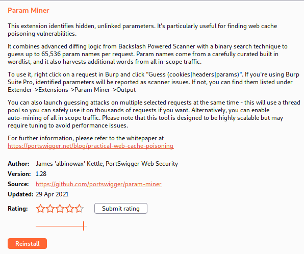
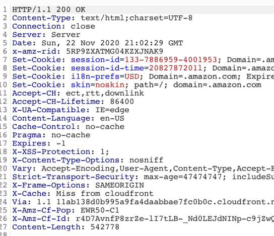
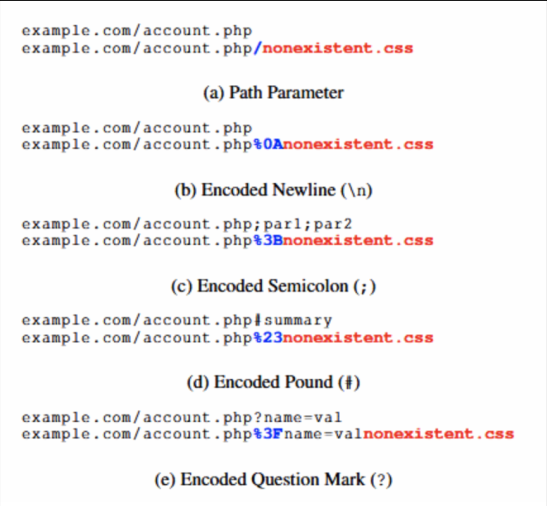

# Caching Servers
## 1. Web Cache Poisoning
- Web cache poisoning is a technique attackers use to force caching servers to server malicious requests. 
- Most commonly this attack is chained with self xss which turns a low impact xss finding into a high impact one since it can be served to any user who visits the cached page.

<b>Working of Cache Servers</b>

- As you can see in the Image, initially when user requests for a URL for something=ok parameter, the request will be sent to server and the response will be saved to cache. However, for rest of 100 times, if the same URL is requested again - the request will get its response from the cache and there will be no need of pinging the server.

- <b>Identify the Cache Requests & Response</b>
	- A cache key is an index entry that uniquely identifies an object in a cache.
	- 
	- If we look at the above request the cache keys would be:
		- GET /embed/v4.js?_=1605995211298
		- Play.vidyard.com
	- 
	- As shown above in the HTTP response the “Vary” header says that the X-ThumbnailAB, X-China, accept-language, and Accept-Encoding headers are also used as cache keys.
	
	
<u>This was all basics, now lets move on to the Web Cache Poisoning Attack:</u>

- If an attacker can somehow inject malicious content into a http response that is cached the same response will be served to other users who request the same endpoint.

- The first step is to find <u>unkeyed input</u>. As mentioned earlier cache keys are used by the caching server to determine which requests are the same and which are different. We need to find keys that don't cause the server to think the request is different. (hence, named Unkeyed).
- The second step is to determine the impact the unkeyed input has on the server, can it be used to exploit an open redirect vulnerability, self xss, or some other vulnerability.
- Finally, you need to figure out if the page is cacheable using the unkeyed input, if it is you should be able to exploit other users when they view the cached page.
- You can use "Param Miner" extension in Burp Suite, to facilitate the finding on unkeyed input
	 
- Now after getting the unkeyed input, work according the results.
- Tips:
	- The “Age” header is also another indicator this page is cached. This value contains the seconds the page has been cached for.
	- The path is normally used when determining if a page has been cached or not, so adding a random GET parameter to the request should cause the response to be cached.
	

## 2. Web Cache Deception
- "An attacker against the caching server"
- With this attack we trick the caching server into caching sensitive information of other users.
- Web cache deception works by sending the victim a URL which will cache the responsefor everyone to see. This exploit is only possible due to path confusion and the fact that some caching servers will cache any request containing a static file such as a png, jpeg, and css.
- One Important thing is: "when a caching server decides to cache a response and when it doesn't "
	- Suppose you have the endpoint “setting.php” which returns a user's name,email,address, and phone number. There could be numerous users access setting.php and each response will be different as the response relies on the user currently logged in so it wouldn't make sense to have caching on this page.
	
	
	- On line 15 there is a header called “cache-control” which is set to “no-cache”. This tells the caching server to not cache this page.
	- The caching server will cache all static pages no matter what the response headers say.
	- So if we were to request example.com/nonexistent.css” the caching server would cache this response regardless of the response headers because it is configured to do so.
- Next let's look at path confusion. Path confusion occurs when an application loads the same resources no matter what the path is. With the rise of large web applications and complicated routing tables path confusion has been introduced.
 
 - As you can see above there is a catch all path on the root directory.
	 - Both the “example.com” and example.com/something'' URL would be sent to the same catch_all function.
 
 
 
 The above image is from the white paper <b>“Cached and Confused: Web Cache Deception in the Wild”</b> and describes several techniques used to cause path confusion.
 1. <b>Path Parameter :</b> It occurs when additional paths added to the request are passed to the same backend function.
  -  So “example.com/account.php” is the same as “example.com/account.php/nonexistent.css” in the eyes of the application. However, the caching server sees example.com/account.php/nonexistent.css”.
  
  2. <b>Encoded Newline</b>: It tries to take advantage of the fact that some proxies and web servers stop reading after the new line character but the caching server does not.
  -  So the webserver sees example.com/account.php” but the caching server sitting in front of the website sees example.com/account.php%0Anonexistent.css” so it caches the response because they are different.
  3. <b>Encoded Semicolon :</b> It takes advantage of the fact that some webservers treat semicolons(;) as parameters. However, the caching server may not recognize this value and treat the request as a separate resource.
  -  The website sees “example.com/account.php” with the parameter “nonexistent.css” but the caching server only sees example.com/account.php%3Bnonexistent.css”.
  4. <b>Encoded Pound :</b> It takes advantage of the fact that web servers often process the pound character as an HTML fragment identifier and stop parsing the URL after that.
  -  However, the caching server may not recognize this so it sees example.com/account.php%23nonexistent.css” while the server sees example.com/account.php”.
  5. <b>Encoded Question Mark :</b> It takes advantage of the fact that web servers treat question marks(?) as parameters but the caching server treats the response different. So the caching server sees example.com/account.php%3fname=valnonexistent.css” but the web server sees “example.com/account.php”.

- To test for web cache deception try one of the several path confusing payloads as shown below:
	- example.com/nonexistent.css
	- example.com/%0Anonexistent.css
	- example.com/%3Bnonexistent.css
	- example.com/%23nonexistent.css
	- example.com/%3fname=valnonexistent.css

---
