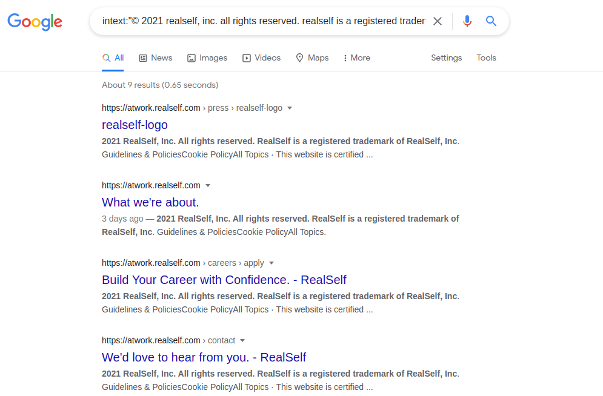

# Reconnaissance [Phase 1]
The beginning of the recon phase is broken down into vertical and horizontal correlation. The idea behind horizontal correlation is to find all assets related to a company. This could be acquisitions, CIDR ranges, and domains that are owned by the same person. Vertical correlation when dealing with domains involves finding all subdomains belonging to a single domain. <br>
 <br>
<b>[Read](https://0xpatrik.com/asset-discovery/) </b> an Article about Enumeration. <br>
<hr>

### 1. CIDR Range
- A **Classless Inter-Domain Routing (CIDR)** range is a short way of representing a group of IP addresses
- CIDR ranges can be used to help identify assets belonging to an organization.
- #### ASN 
	- An** Autonomous System Number (ASN**) is a way to represent a collection of IPs and who owns them.
	- <b> ASN Lookup </b> : 
		- We can use [MxToolbox](https://mxtoolbox.com/asn.aspx) or [Huricane ](https://bgp.he.net/) to find a company’s ASN as well as their correlating CIDR ranges
- #### Reverse Whois
	- When registering a domain your information is saved in a whois database. This information contains the *registers name, address, email,* and much more. Searching the whois database we can find all domains registered by the email ***.example.com**
	- Using historical whois data to perform reverse whois searches is an excellent way to find domains that were purchased by the same organization. Companies often own more than one domain so finding these additional assets can help widen your scope.
- #### Reverse DNS
	- DNS records contain several bits of information that can be used to correlate domains to one another. The A, NS, and MX records are the most popular ways to find domains that are likely to be owned by the same person. 
		- If domains share the same A, NS, or MX record then it is possible they are owned by the same person. We can use reverse IP, reverse name server, and reverse mail server searches to find these domains. <br>
- #### Reverse Name Server
	- 
	-  We can use the tool called [Domaineye](assets/dns-server-lookup) 
 - #### Reverse Mail Server
	 - 
	 - We can use the same technique to perform reverse mail server searches. Just like before the MX record returned must be owned by the target organization.
 - Conclusion
	 - DNS records can be used to tie domains together. If domains share the same A, NS, or MX record we can assume they are owned by the same entity. There may be some false positives but these can be filtered out.
		 - It Will increase Your Scope in Bug Hunting.
<br>

### 2. Google Dorking

- Dorking is no doubt a great option for filtering your results according to your purpose. We can perform several tasks through the google dorking. For Example: 
	- We can then take that copyright text (A Copyright statement is unique for each website, located at the bottom of the web page) and search for every other website that contains this text.
	-  <i> intext:"© 2021 realself, inc. all rights reserved. realself is a registered trademark of realself, inc." </i>
	-  
<br>

### 3. Tools - Amass

- Amass is the most popular asset discovery tool there is. This tool has many features and acts as the Swiss army knife of asset discovery.
- We can perform several Discovery Actions using this tool. Some of the Informations that can be revealed using this tool are listed below: 
	-  <b>ASN</b>: we can use a company’s ASN number to find a list of assets belong to the organization. First, we must find a list ASN numbers assigned to an organization using the following amass command:
		-  ```
		amass intel -org <company name here>
		- 
		- This command will return a list of ASN numbers that might belong to the organization.
	- <b>CIDR Range</b>: Now that you have a list of ASN numbers you can find the associated CIDR range by using the following bash command:
		- ```
		whois -h whois.radb.net -- '-i origin <ASN Number Here>' | grep -Eo "([0-9.]+){4}/[0-9]+" | sort -u
		-	
	-	<b>List of Domain</b>: You can also use amass to find a list of domains running on a given ASN. This will use reverse IP searches to find domains running on the IPs in the specified ASN. The following command can be used to find domains running on a given ASN:
		-	```
		amass intel -asn <ASN Number Here>
		- Amass can also be used to find domains on a given CIDR range. We can use the following command to find these endpoints:
		- ```
		amass intel -cidr <CIDR Range Here>
	- <b>Reverse Whois</b>: Given a specific domain amass can utilize reverse whois searches to find other domains purchased by the same user. The following command can be used to issue this request: 
		- ```
		amass intel -whois -d <Domain Name Here> 
		- 
