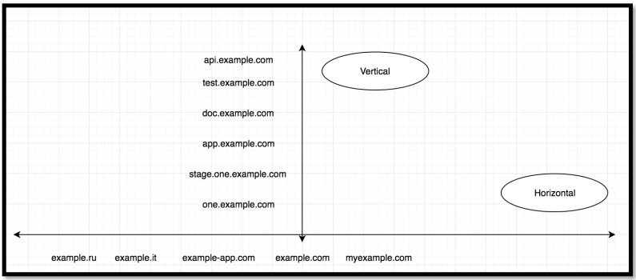
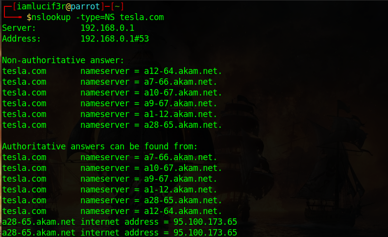

# Reconnaissance [Phase 1]
The beginning of the recon phase is broken down into vertical and horizontal correlation. The idea behind horizontal correlation is to find all assets related to a company. This could be acquisitions, CIDR ranges, and domains that are owned by the same person. Vertical correlation when dealing with domains involves finding all subdomains belonging to a single domain.  
  
<b>[Read](https://0xpatrik.com/asset-discovery/) </b> an Article about Enumeration.  

### 1. CIDR Range
- A **Classless Inter-Domain Routing (CIDR)** range is a short way of representing a group of IP addresses
- CIDR ranges can be used to help identify assets belonging to an organization.
- #### ASN 
	- An** Autonomous System Number (ASN**) is a way to represent a collection of IPs and who owns them.
	- <b> ASN Lookup </b> : 
		- We can use [MxToolbox](https://mxtoolbox.com/asn.aspx) or [Huricane ](https://bgp.he.net/) to find a company’s ASN as well as their correlating CIDR ranges
- #### Reverse Whois
	- When registering a domain your information is saved in a whois database. This information contains the *registers name, address, email,* and much more. Searching the whois database we can find all domains registered by the email ***.example.com**
	- Using historical whois data to perform reverse whois searches is an excellent way to find domains that were purchased by the same organization. Companies often own more than one domain so finding these additional assets can help widen your scope.
- #### Reverse DNS
	- DNS records contain several bits of information that can be used to correlate domains to one another. The A, NS, and MX records are the most popular ways to find domains that are likely to be owned by the same person. 
		- If domains share the same A, NS, or MX record then it is possible they are owned by the same person. We can use reverse IP, reverse name server, and reverse mail server searches to find these domains.
- #### Reverse Name Server
	- 
	-  We can use the tool called [Domaineye](assets/dns-server-lookup)
 